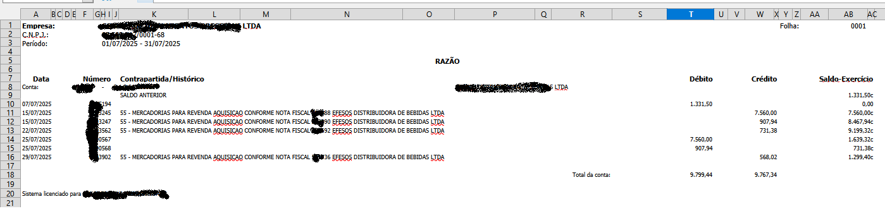
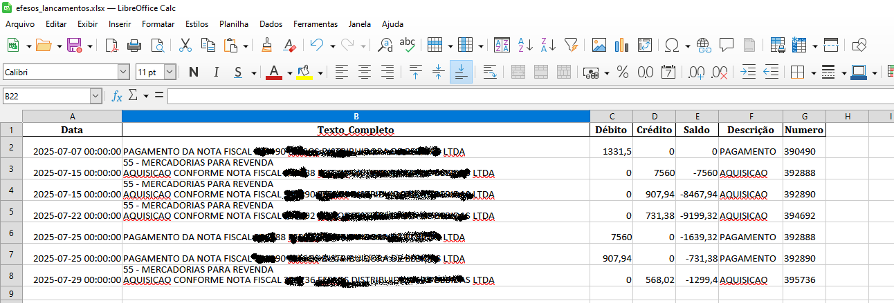
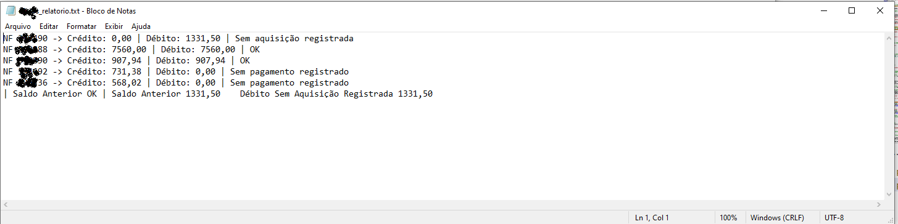

🛠 Tecnologias Utilizadas

Python

Tkinter

Pandas + NumPy

pdfplumber + pdfminer.six

OpenPyXL

Pillow

BeautifulSoup

Regex

LibreOffice (headless)

PyInstaller

🚀 Principais Funcionalidades

Processamento automático de planilhas (.xls e .xlsx)

Conversão de arquivos via LibreOffice headless

Extração e tratamento de dados com Regex e Pandas/NumPy

Leitura e análise de PDFs com pdfplumber/pdfminer.six

Geração de relatórios detalhados em .txt e planilhas processadas em .xlsx

Interface gráfica intuitiva para parametrização de arquivos e pastas

Distribuição facilitada como executável standalone (.exe)

🖥️ UI - Telas do Aplicativo
A interface gráfica de usuário (GUI) é construída com Tkinter e apresenta os seguintes elementos para o processamento:

Tela de Entrada e Saída
Esta tela inicial permite ao usuário carregar o arquivo de entrada .xls/.xlsx para quando for .xls por incompatibilidade com arquivo é convertido para o .xlsx via LibreOffice headless.

✅ Resultados Obtidos

Automação de verificações contábeis (Débito x Crédito por Nota Fiscal, saldo anterior)

Relatórios confiáveis e consistentes

Maior agilidade e confiabilidade na análise contábil

Distribuição simplificada do sistema como executável independente
